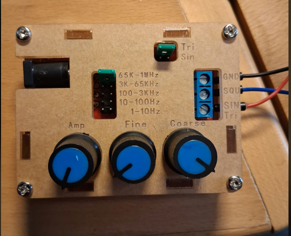
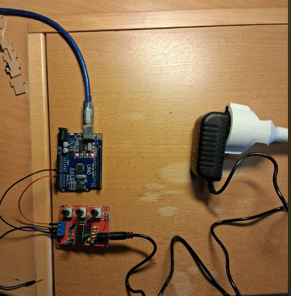
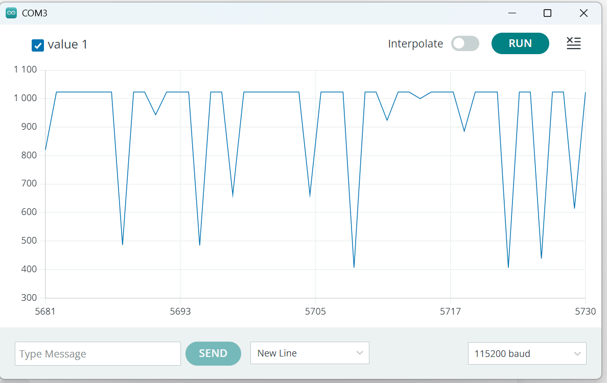

# XR2206 Function Generator & Arduino Visualizer

A DIY **XR2206 Function Generator** project, fully assembled, soldered, and mounted into its protective enclosure, integrated with an **Arduino Uno** to plot live waveforms.



## Overview & Status
The PCB is fully assembled, cleaned, and housed in a protective case, powered via a 12V adapter and connected to an Arduino Uno for real-time signal visualization.

## Hardware Wiring
- **GND (Generator)** -> **GND (Arduino)**
- **SIN/TRI (Generator)** -> **Analog Pin A0 (Arduino)** *(Keep amplitude adjusted to stay within safe 5V limits)*



## Software (Arduino Code)
```cpp
const int signalPin = A0; 
void setup() { Serial.begin(115200); }
void loop() { Serial.println(analogRead(signalPin)); delay(10); }
```

## Results

